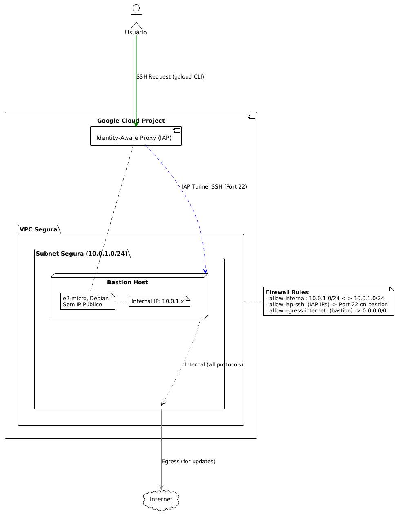
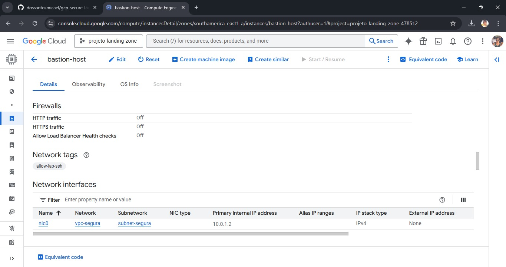
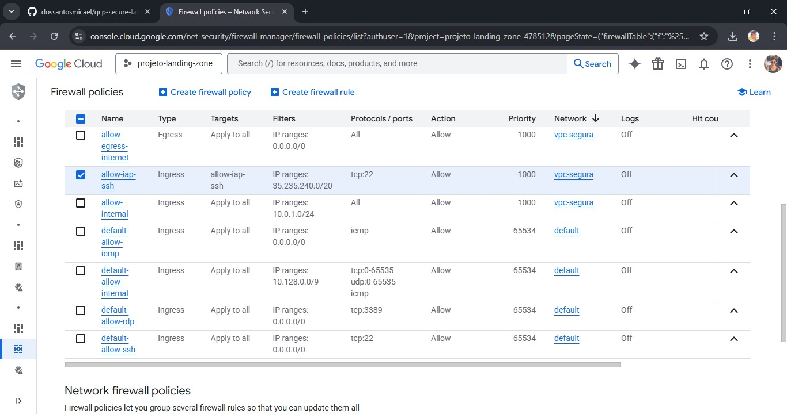
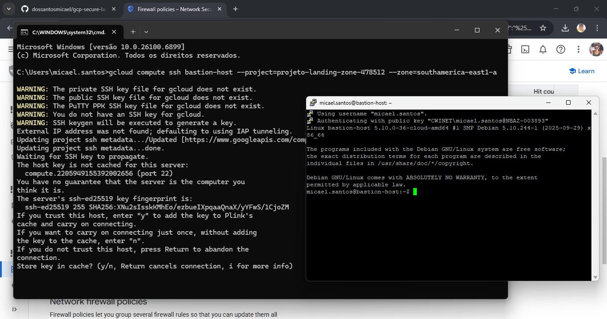
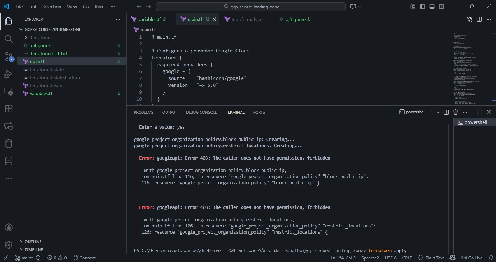

# 🚀 GCP Secure Landing Zone com Terraform

Este projeto demonstra a criação de uma `Landing Zone` segura no Google Cloud Platform (GCP) utilizando Infraestrutura como Código (IaC) com `Terraform`.

A arquitetura segue princípios modernos de segurança, como `Zero Trust`, `Policy as Code (PaC)` e `Menor Privilégio`, criando um ambiente seguro, automatizado e compatível com boas práticas corporativas.

---

## 📚 Sumário

- [🚀 GCP Secure Landing Zone com Terraform](#-gcp-secure-landing-zone-com-terraform)
  - [📚 Sumário](#-sumário)
  - [Visão Geral](#visão-geral)
  - [🛡️ Princípios de Segurança Demonstrados](#️-princípios-de-segurança-demonstrados)
  - [🏗️ Arquitetura Implantada](#️-arquitetura-implantada)
  - [🧩 Diagrama da Arquitetura](#-diagrama-da-arquitetura)
  - [🔬 Evidências](#-evidências)
    - [Evidência 1: VM Sem Exposição à Internet](#evidência-1-vm-sem-exposição-à-internet)
    - [Evidência 2: Regras de Firewall Zero Trust](#evidência-2-regras-de-firewall-zero-trust)
    - [Evidência 3: Acesso via IAP funcionando](#evidência-3-acesso-via-iap-funcionando)
  - [💡 Análise de Policy as Code (PaC)](#-análise-de-policy-as-code-pac)
    - [O Resultado (Erro 403)](#o-resultado-erro-403)
  - [🧰 Pré-requisitos](#-pré-requisitos)
  - [🚀 Como Executar](#-como-executar)
  - [🧹 Como Limpar](#-como-limpar)
  - [📬 Contato](#-contato)

---

## Visão Geral

Este projeto cria uma fundação segura em GCP, incluindo:

* `VPC personalizada`
* `Subrede privada`
* `Firewall com política de negação por padrão`
* `Bastion host sem IP público`
* `Acesso seguro via IAP (Identity-Aware Proxy)`

Tudo é implantado utilizando Terraform, garantindo rastreabilidade, repetibilidade e automação total.

## 🛡️ Princípios de Segurança Demonstrados

✔️ **Infraestrutura como Código (IaC)**
* Código 100% versionável e auditável.
* Evita `configuration drift` (alterações manuais não rastreadas).
* Infraestrutura `reprodutível` em qualquer ambiente.

✔️ **Zero Trust (IAP)**
* A `VM (bastion-host)` não tem IP público externo, tornando-a invisível na internet.
* O acesso é feito exclusivamente via túnel autenticado do `Google IAP`, que verifica a identidade e a autorização do usuário antes de permitir a conexão SSH.
* Bloqueia qualquer tentativa de acesso direto via internet.

✔️ **Princípio do Menor Privilégio**
* `Firewall restrito` com política de `negação por padrão` para o tráfego de entrada.
* A porta `SSH (22)` é liberada *somente* para o range de IP oficial do Google IAP, impedindo acessos de outras fontes.
* Configurações de rede focadas em conceder o mínimo acesso necessário.

✔️ **Policy as Code (PaC)**
* `Policies corporativas` são simuladas no código (atualmente comentadas devido a limitações do ambiente).
* Demonstra como prevenir configurações inseguras ou não conformes em larga escala.
* O `erro 403` gerado intencionalmente (e documentado) demonstra a `separação de responsabilidades` entre administradores de projeto e administradores de organização no GCP.

## 🏗️ Arquitetura Implantada

O Terraform cria os seguintes recursos:

* **VPC personalizada (`vpc-segura`):** Uma rede privada isolada, sem sub-redes automáticas.
* **Subrede privada (`subnet-segura`):** Uma sub-rede com CIDR `10.0.1.0/24` dentro da `vpc-segura`.
* **Regras de Firewall Zero Trust:**
    * `allow-internal`: Permite comunicação entre recursos dentro da `subnet-segura`.
    * `allow-iap-ssh`: Permite tráfego SSH (`porta 22`) *apenas* dos IPs do Google IAP (`35.235.240.0/20`) para VMs com a tag `allow-iap-ssh`.
    * `allow-egress-internet`: Permite que VMs acessem a internet (para atualizações e pacotes), mas não permite conexões de entrada da internet.
* **Instância Bastion (`bastion-host`):**
    * Máquina virtual `e2-micro` (elegível para o Nível Gratuito do GCP).
    * **Não possui IP público externo.**
    * Recebe a tag de rede `allow-iap-ssh` para aplicar a regra de firewall específica.

## 🧩 Diagrama da Arquitetura

O diagrama abaixo ilustra a arquitetura da Landing Zone segura, destacando o fluxo de acesso via IAP e a comunicação dentro da VPC.



## 🔬 Evidências

As seguintes evidências visuais comprovam a correta implantação e a postura de segurança do ambiente.

### Evidência 1: VM Sem Exposição à Internet
Confirmado no Console do GCP, a instância `bastion-host` foi implantada com sucesso **sem um IP Externo**, garantindo que não está diretamente acessível pela internet.



### Evidência 2: Regras de Firewall Zero Trust
A lista de regras de firewall para a `vpc-segura` mostra que a única regra de SSH (`allow-iap-ssh`) está restrita ao range de IP do Google IAP, bloqueando qualquer outra tentativa de conexão externa.



### Evidência 3: Acesso via IAP funcionando
Este screenshot do terminal demonstra o sucesso do acesso via `gcloud compute ssh` ao `bastion-host`, confirmando que o mecanismo Zero Trust do IAP está operacional.



---

## 💡 Análise de Policy as Code (PaC)

Um objetivo principal deste projeto era aplicar **Políticas da Organização (Guardrails)**. O código no `main.tf` inclui dois blocos de política (atualmente comentados) que visavam:

1.  `compute.vmExternalIpAccess`: Proibir a criação de VMs com IPs públicos.
2.  `gcp.resourceLocations`: Restringir a criação de recursos apenas à região `southamerica-east1`.

### O Resultado (Erro 403)

Durante a execução inicial (`terraform apply`), a aplicação dessas políticas falhou com um erro **`Erro 403: Forbidden`**, como visto diretamente no terminal do Terraform:



**Esta falha é uma demonstração de segurança fundamental do GCP.** O erro ocorreu porque este projeto foi executado em uma conta de nuvem pessoal **sem um Nó de Organização** do Google Cloud.

A API de Políticas da Organização só está disponível para projetos que fazem parte de uma Organização (normalmente vinculada a uma conta do Google Workspace ou Cloud Identity). Isso demonstra uma **Separação de Deveres**: o "Dono do Projeto" (eu) não deve poder anular as políticas de segurança de nível superior definidas pelo "Administrador da Organização" (`roles/orgpolicy.policyAdmin`).

O código permanece comentado no `main.tf` para demonstrar o conceito de PaC como seria aplicado em um ambiente corporativo real.

---

## 🧰 Pré-requisitos

Para executar este projeto, você precisará de:

* Uma conta GCP com `billing` ativado.
* `Terraform` instalado (versão recomendada: `>= 1.5`).
* `Google Cloud SDK` (gcloud CLI) instalado e autenticado.
* **Permissões mínimas no projeto GCP:**
    * `roles/compute.admin` (Administrador da Instância Compute)
    * `roles/compute.networkAdmin` (Administrador da Rede Compute)
    * `roles/iam.serviceAccountUser` (Usuário da Conta de Serviço)
    * `roles/iap.tunnelResourceAccessor` (Usuário do túnel IAP-secured) - Necessário para o acesso SSH via IAP.

## 🚀 Como Executar

Siga os passos abaixo para implantar a Landing Zone segura:

1.  **Clonar o repositório:**
    ```bash
    git clone [https://github.com/SEU-USUARIO/SEU-REPO.git](https://github.com/SEU-USUARIO/SEU-REPO.git)
    cd SEU-REPO-FOLDER
    ```
2.  **Autenticar no GCP:**
    ```bash
    gcloud auth application-default login
    ```
3.  **Definir seu projeto no `terraform.tfvars`:**
    * Crie um arquivo `terraform.tfvars` na raiz do projeto (se não existir).
    * Substitua `SEU_PROJETO_ID`, `SUA_REGIAO` e `SUA_ZONA` pelos seus valores reais:
        ```terraform
        gcp_project_id = "SEU_PROJETO_ID"
        gcp_region     = "SUA_REGIAO"        # Ex: "southamerica-east1"
        gcp_zone       = "SUA_ZONA"          # Ex: "southamerica-east1-a"
        ```
4.  **Inicializar Terraform:**
    ```bash
    terraform init
    ```
5.  **Revisar o plano:**
    ```bash
    terraform plan
    ```
6.  **Aplicar:**
    ```bash
    terraform apply
    ```
    Digite `yes` quando solicitado.

## 🧹 Como Limpar

Para destruir todos os recursos implantados pelo Terraform e evitar custos, execute:

```bash
terraform destroy
```
Digite `yes` quando solicitado.

## 📬 Contato

Se quiser sugerir melhorias ou trocar ideias sobre GCP, Terraform ou segurança, fique à vontade!

- 📧 Email: dossantosmicael.ms@gmail.com  
- 🔗 LinkedIn: https://www.linkedin.com/in/micael-dos-santos-35b513241 
- 💻 GitHub: https://github.com/dossantosmicael
- 🤝 Contribuições são bem-vindas — sinta-se à vontade para abrir uma issue ou enviar um pull request.  
- ☕ Projeto criado com foco em estudo, boas práticas e melhoria contínua.
